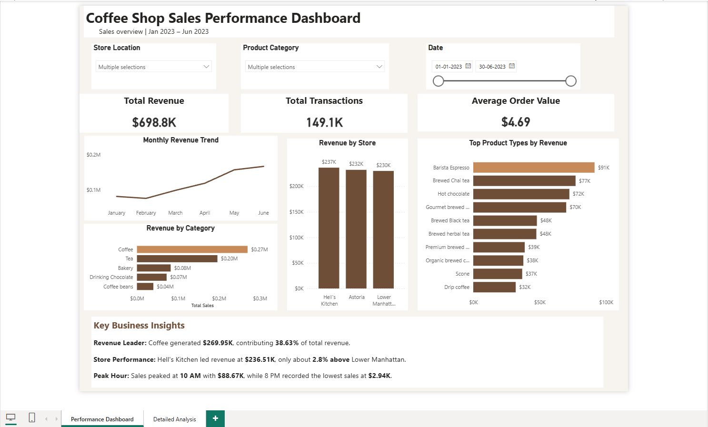

# Coffee Shop Sales Performance Dashboard

## Project Overview

An interactive Power BI dashboard developed to analyze coffee shop sales performance across stores, product categories, product types, and time periods.

## Business Objective

The objective of this project is to understand revenue performance, identify key sales drivers, compare store performance, and identify peak sales periods to support data-driven business decisions.

## Dataset

The dataset contains transaction-level coffee shop sales data, including:

- Transaction date and time
- Store location
- Product category
- Product type
- Quantity
- Sales amount

## Tools Used

- Power BI
- DAX
- Power Query
- Excel

## Data Preparation

The data was prepared using Power Query by:

- Validating data types
- Checking data quality
- Checking for errors and duplicates
- Creating required analytical fields
- Creating a Date Table for time-based analysis

## Data Modeling & DAX

A data model was created to support analysis and reporting.

Key DAX measures included:

- Total Revenue
- Total Transactions
- Total Quantity
- Average Order Value
- Revenue percentage
- Other supporting business metrics

A dedicated Date Table was also created to support time-based analysis.

## Dashboard Features

The interactive dashboard includes:

- Total Revenue KPI
- Total Transactions KPI
- Average Order Value KPI
- Monthly revenue trend
- Store performance analysis
- Top 5 product categories
- Top 10 product types
- Sales by hour
- Interactive store slicer
- Category slicer
- Date-range slicer

## Key Business Insights

- **Revenue Leader:** Coffee generated **$269.95K**, contributing **38.63%** of total revenue.
- **Store Performance:** Hell's Kitchen led revenue at **$236.51K**, approximately **2.8% higher** than Lower Manhattan.
- **Peak Hour:** Sales peaked at **10 AM** with **$88.67K**, while **8 PM** recorded the lowest sales at **$2.94K**.

## Business Recommendations

- Ensure sufficient inventory availability before peak sales periods to reduce the risk of stockouts.
- Review staffing levels around peak hours to maintain service efficiency and reduce customer waiting times.
- Investigate the product types driving Coffee category revenue to identify opportunities for targeted promotions or bundles.
- Analyze lower-performing periods and stores further to identify potential operational or demand-related factors.

## Dashboard Preview

## Files

- `Coffee Shop Sales Dashboard.pbix` — Power BI dashboard
- `Raw Data.xlsx` — Original transaction dataset
- `coffee-shop-dashboard.png` — Dashboard preview

## Skills Demonstrated

- Data Cleaning
- Data Transformation
- Data Modeling
- DAX
- Power Query
- Power BI Dashboard Development
- KPI Development
- Data Visualization
- Business Analysis
- Time-Based Analysis
- Data Storytelling